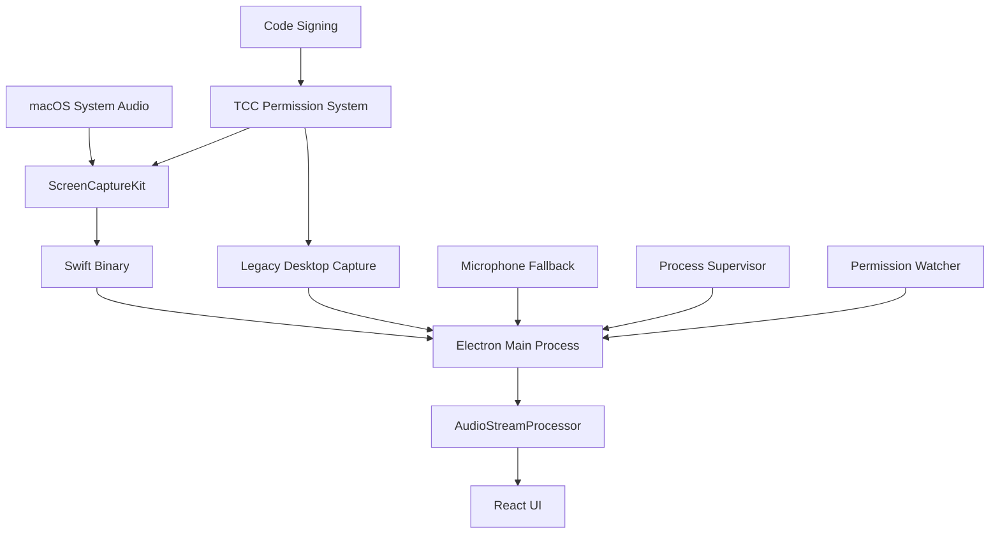
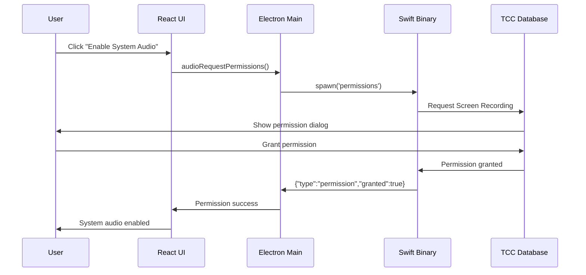
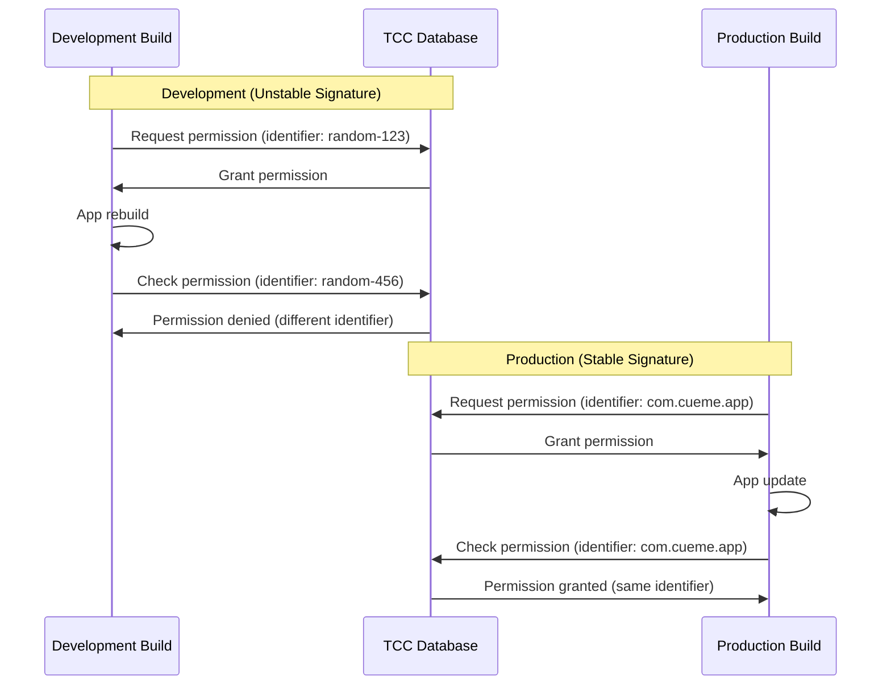

# 🎵 CueMe System Audio Recording Architecture

## Overview

CueMe implements a sophisticated multi-layered system audio recording architecture that captures system-wide audio output (e.g., from Zoom meetings, YouTube videos) for real-time transcription and question detection. This document explains the complete technical implementation from hardware-level capture to AI processing.

---

## 🏗️ **Architecture Overview**



### Key Components

1. **Native Layer**: Swift ScreenCaptureKit binary for high-performance audio capture
2. **Electron Bridge**: Main process coordination and IPC communication
3. **Permission Management**: TCC integration and permission persistence
4. **Fallback Systems**: Legacy capture and microphone alternatives
5. **React UI**: User controls and real-time feedback

---

## 🔧 **Technical Implementation**

### 1. Native Audio Capture Layer

#### **ScreenCaptureKit Integration** (Primary Method)

**File**: [`native-modules/system-audio/SystemAudioCapture.swift`](file:///Users/kotan/CueMeFinal-1/native-modules/system-audio/SystemAudioCapture.swift)

```swift
// Simplified overview of the Swift implementation
import ScreenCaptureKit
import AVFoundation

class SystemAudioCapture {
    private var stream: SCStream?
    private var configuration: SCStreamConfiguration
    
    func startCapture() {
        // 1. Request ScreenCaptureKit permissions
        // 2. Get available displays and applications
        // 3. Configure audio capture (48kHz, stereo)
        // 4. Start streaming with real-time callbacks
        // 5. Convert audio to JSON format for Electron
    }
}
```

**Key Features**:
- **High Performance**: Direct hardware audio access via ScreenCaptureKit
- **Real-time Streaming**: Audio data streamed in 48kHz stereo Float32 format
- **JSON Communication**: Structured communication with Electron via stdout/stdin
- **macOS 13+ Required**: Leverages latest ScreenCaptureKit APIs

**Build Process**:
```bash
# Build command (from native-modules/system-audio/)
swiftc -o SystemAudioCapture \
    -target arm64-apple-macos13.0 \
    -O \
    SystemAudioCapture.swift

# Code signing with entitlements
codesign --force --sign - \
    --entitlements entitlements.plist \
    --timestamp --deep \
    SystemAudioCapture
```

#### **Binary Communication Protocol**

The Swift binary communicates with Electron via JSON messages:

**Status Check**:
```bash
./SystemAudioCapture status
# Output: {"type":"status","data":{"isAvailable":true,"screenCaptureKitSupported":true}}
```

**Permission Request**:
```bash
./SystemAudioCapture permissions
# Output: {"type":"permission","granted":true}
```

**Audio Streaming**:
```bash
./SystemAudioCapture start-stream
# Continuous output: {"type":"audio","data":"<base64-encoded-float32-audio>","sampleRate":48000}
```

### 2. Electron Integration Layer

#### **SystemAudioCapture Class** 

**File**: [`electron/SystemAudioCapture.ts`](file:///Users/kotan/CueMeFinal-1/electron/SystemAudioCapture.ts)

```typescript
export class SystemAudioCapture extends EventEmitter {
  private swiftProcess: ChildProcess | null = null;
  private swiftBinaryPath: string;
  private useScreenCaptureKit: boolean = false;

  constructor() {
    // Determine binary path (dev vs production)
    const isDev = !app.isPackaged;
    this.swiftBinaryPath = isDev 
      ? path.join(process.cwd(), 'dist-native', 'SystemAudioCapture')
      : path.join(process.resourcesPath, 'dist-native', 'SystemAudioCapture');
    
    this.checkScreenCaptureKitAvailability();
  }

  public async getAvailableSources(): Promise<AudioSource[]> {
    // 1. Check binary existence and permissions
    // 2. Test ScreenCaptureKit availability
    // 3. Return available audio sources with status
  }

  private async startScreenCaptureKitCapture(): Promise<void> {
    // 1. Spawn Swift binary with 'start-stream' command
    // 2. Parse JSON audio data from stdout
    // 3. Convert Float32 stereo to Int16 mono
    // 4. Emit processed audio data
  }
}
```

**Key Responsibilities**:
- **Binary Management**: Spawning and monitoring Swift processes
- **Audio Format Conversion**: Float32 stereo → Int16 mono for pipeline compatibility
- **Error Handling**: Timeout detection and graceful fallbacks
- **Status Monitoring**: Real-time capability checking

#### **AudioStreamProcessor Integration**

**File**: [`electron/AudioStreamProcessor.ts`](file:///Users/kotan/CueMeFinal-1/electron/AudioStreamProcessor.ts)

```typescript
export class AudioStreamProcessor extends EventEmitter {
  private systemAudioCapture: SystemAudioCapture;
  private permissionWatcher: PermissionWatcher;
  private processSupervisor: ProcessSupervisor;

  public async startListening(audioSourceId?: string): Promise<void> {
    if (audioSourceId === 'system-audio') {
      // 1. Start SystemAudioCapture
      // 2. Register with ProcessSupervisor  
      // 3. Setup audio data forwarding
      // 4. Handle permission errors with fallbacks
    }
  }

  private setupSystemAudioEvents(): void {
    this.systemAudioCapture.on('audio-data', (audioData: Buffer) => {
      // Forward system audio to existing pipeline
      this.processAudioChunk(audioData);
    });
  }
}
```

### 3. Legacy Fallback System

When ScreenCaptureKit is unavailable, CueMe falls back to Electron's built-in desktop capture:

```typescript
private async startSystemAudioCapture(): Promise<void> {
  // 1. Use desktopCapturer.getSources() to get screen sources
  // 2. Create MediaStream with chromeMediaSource: 'desktop'
  // 3. Process audio through Web Audio API
  // 4. Convert to consistent format for pipeline
}
```

**Limitations**:
- Requires Screen Recording permission
- May have compatibility issues with some applications
- Lower performance compared to ScreenCaptureKit

---

## 🔐 **Permission Management System**

### macOS TCC (Transparency, Consent, Control) Integration

#### **Required Permissions**

1. **Screen Recording Permission**
   - **Purpose**: Required for both ScreenCaptureKit and legacy desktop capture
   - **Scope**: System-wide audio and screen content access
   - **Persistence**: Tied to app's code signature identifier

2. **Microphone Permission** (fallback)
   - **Purpose**: Direct microphone access when system audio unavailable
   - **Scope**: Hardware microphone input
   - **Persistence**: More stable, less affected by signature changes

#### **Permission Storage and State Management**

**File**: [`electron/PermissionStorage.ts`](file:///Users/kotan/CueMeFinal-1/electron/PermissionStorage.ts)

```typescript
export class PermissionStorage {
  public async getCurrentPermissionStatus(): Promise<{
    microphone: 'granted' | 'denied' | 'restricted' | 'unknown' | 'not-determined'
    screenCapture: 'granted' | 'denied' | 'restricted' | 'unknown' | 'not-determined'
  }> {
    // Use systemPreferences.getMediaAccessStatus() to check TCC database
    const microphoneStatus = systemPreferences.getMediaAccessStatus('microphone');
    const screenCaptureStatus = systemPreferences.getMediaAccessStatus('screen');
    
    return { microphone: microphoneStatus, screenCapture: screenCaptureStatus };
  }
}
```

**State Persistence**:
- Encrypted local storage in `~/Library/Application Support/CueMe/permission-state.json`
- Tracks setup completion and permission grant history
- AES-256-GCM encryption for security

#### **Permission Monitoring and Recovery**

**File**: [`electron/core/PermissionWatcher.ts`](file:///Users/kotan/CueMeFinal-1/electron/core/PermissionWatcher.ts)

```typescript
export class PermissionWatcher extends EventEmitter {
  public startWatching(): void {
    // Poll TCC database every 2 seconds for permission changes
    this.watchInterval = setInterval(() => {
      this.updatePermissionStatus();
    }, 2000);
  }

  private updatePermissionStatus(): void {
    const screenCaptureStatus = systemPreferences.getMediaAccessStatus('screen');
    
    // Detect permission grants and trigger automatic retry
    if (this.lastScreenCaptureStatus !== 'granted' && screenCaptureStatus === 'granted') {
      this.emit('screen-recording-granted');
    }
  }

  private canActuallyAccessSystemAudio(): boolean {
    // Test if binary can actually access system audio (not just permission status)
    const output = execSync(`"${binaryPath}" status`);
    const result = JSON.parse(output.trim());
    return result.data?.isAvailable === true;
  }
}
```

### Universal Permission Management

**File**: [`electron/core/UniversalPermissionManager.ts`](file:///Users/kotan/CueMeFinal-1/electron/core/UniversalPermissionManager.ts)

```typescript
export class UniversalPermissionManager extends EventEmitter {
  public async initialize(): Promise<void> {
    // 1. Validate binary signature and environment
    // 2. Start process supervision to prevent conflicts  
    // 3. Start permission monitoring
    // 4. Handle first-time vs returning user flows
  }

  private async validateBinaryEnvironment(): Promise<BinaryValidation> {
    // Check production vs development build
    // Verify binary existence and signatures
    // Provide specific recommendations for issues
  }
}
```

---

## 🚨 **Common Issues and Solutions**

### Issue 1: Development Build Permission Loss

**Problem**: Permissions revoked after each rebuild in development
**Root Cause**: Unstable adhoc code signatures
**Solution**: Apply stable development signature

```bash
# Fix development signature stability
./scripts/sign-electron-dev.sh

# This applies: codesign --force --deep --sign - --identifier com.cueme.electron.dev ./node_modules/electron/dist/Electron.app
```

### Issue 2: Binary Not Found or Execution Failed

**Problem**: SystemAudioCapture binary missing or won't execute
**Root Cause**: Build process failed or incorrect permissions
**Solution**: Rebuild with proper signing

```bash
# Rebuild native binary
npm run build:native

# Or manually:
cd native-modules/system-audio
./build.sh
```

### Issue 3: Permission Granted but Still Not Working

**Problem**: TCC shows permission granted but system audio still fails
**Root Cause**: Signature mismatch between granted permission and current app
**Solution**: Use production build or re-grant with stable signature

```bash
# Test with production build (most reliable)
./scripts/run-production-for-audio.sh

# Or fix development signature
./scripts/sign-electron-dev.sh
```

### Issue 4: Process Conflicts

**Problem**: Multiple audio processes causing permission conflicts
**Root Cause**: Previous instances not properly cleaned up
**Solution**: Process supervision and cleanup

**File**: [`electron/core/ProcessSupervisor.ts`](file:///Users/kotan/CueMeFinal-1/electron/core/ProcessSupervisor.ts)

```typescript
export class ProcessSupervisor extends EventEmitter {
  public startSupervision(): void {
    // 1. Find existing audio processes
    // 2. Terminate conflicting instances
    // 3. Monitor for new conflicts
    // 4. Ensure single audio process at a time
  }

  private findAudioProcesses(): Array<{pid: number; name: string}> {
    // Use ps aux to find SystemAudioCapture and CueMe processes
    // Return list for conflict resolution
  }
}
```

---

## 🎛️ **User Interface Integration**

### Audio Source Selection

**File**: [`src/components/AudioSettings.tsx`](file:///Users/kotan/CueMeFinal-1/src/components/AudioSettings.tsx)

```typescript
const loadAudioSources = async () => {
  const result = await window.electronAPI.audioGetSources();
  // Returns: [
  //   { id: 'microphone', name: 'Microphone', type: 'microphone', available: true },
  //   { id: 'system-audio', name: 'System Audio (ScreenCaptureKit)', type: 'system', available: false }
  // ]
};
```

**Source Availability Logic**:
- **Available**: Permission granted AND binary functional AND no conflicts
- **Unavailable**: Missing permissions OR binary issues OR system conflicts
- **Visual Feedback**: Disabled buttons, error messages, status indicators

### First Launch Setup

**File**: [`src/components/FirstLaunchSetup.tsx`](file:///Users/kotan/CueMeFinal-1/src/components/FirstLaunchSetup.tsx)

**Flow**:
1. **Welcome**: Explain what permissions are needed
2. **Permission Requests**: Guide user through granting each permission
3. **Testing**: Verify system audio actually works
4. **Completion**: Save setup state and enable full functionality

---

## 🔄 **Audio Processing Pipeline**

### 1. Audio Capture

```typescript
// ScreenCaptureKit (Primary)
Swift Binary → Float32 Stereo (48kHz) → Base64 JSON → Electron

// Legacy Fallback  
desktopCapturer → MediaStream → Web Audio API → Float32 → Electron

// Microphone Fallback
getUserMedia → MediaStream → Web Audio API → Float32 → Electron
```

### 2. Format Conversion

**File**: [`electron/SystemAudioCapture.ts`](file:///Users/kotan/CueMeFinal-1/electron/SystemAudioCapture.ts)

```typescript
private convertFloat32StereoToInt16Mono(audioBuffer: Buffer, sourceSampleRate: number, targetSampleRate: number): Buffer {
  // 1. Parse Float32 stereo data from Swift binary
  // 2. Convert stereo to mono by averaging channels
  // 3. Resample from 48kHz to 16kHz (for OpenAI Whisper)
  // 4. Convert Float32 to Int16 for existing pipeline
  // 5. Return Buffer for AudioStreamProcessor
}
```

### 3. Stream Processing

**File**: [`electron/AudioStreamProcessor.ts`](file:///Users/kotan/CueMeFinal-1/electron/AudioStreamProcessor.ts)

```typescript
export class AudioStreamProcessor extends EventEmitter {
  public async processAudioChunk(audioData: Buffer): Promise<void> {
    // 1. Convert Buffer to Float32Array
    // 2. Accumulate audio samples  
    // 3. Check if chunk should be created (800ms+ duration)
    // 4. Send to transcription pipeline
    // 5. Detect questions using AI patterns
  }

  private async transcribeChunk(chunk: AudioChunk): Promise<void> {
    // 1. Send to OpenAI Whisper for transcription
    // 2. Update streaming question detector
    // 3. Refine questions algorithmically  
    // 4. Emit detected questions to UI
  }
}
```

---

## 🔒 **Code Signing and Security**

### Code Signing Strategy

#### **Development Builds**
```bash
# Stable development signature (prevents permission loss)
codesign --force --deep --sign - \
  --identifier com.cueme.electron.dev \
  ./node_modules/electron/dist/Electron.app

# SystemAudioCapture binary signing
codesign --force --sign - \
  --entitlements entitlements.plist \
  --timestamp --deep \
  ./dist-native/SystemAudioCapture
```

#### **Production Builds**
**File**: [`scripts/afterPack.js`](file:///Users/kotan/CueMeFinal-1/scripts/afterPack.js)

```javascript
module.exports = async function(context) {
  // 1. Set execute permissions (755)
  // 2. Code sign with proper identity and entitlements
  // 3. Verify signature integrity
  // 4. Test binary functionality
  // 5. Ensure TCC compatibility
}
```

### Required Entitlements

**File**: [`native-modules/system-audio/entitlements.plist`](file:///Users/kotan/CueMeFinal-1/native-modules/system-audio/entitlements.plist)

```xml
<key>com.apple.security.device.screen-capture</key>
<true/>
<key>com.apple.security.cs.allow-dyld-environment-variables</key>
<true/>
<key>com.apple.security.cs.allow-jit</key>
<true/>
```

**Purpose**:
- **screen-capture**: Access to ScreenCaptureKit APIs
- **allow-dyld-environment-variables**: Runtime library loading
- **allow-jit**: Just-in-time compilation for Swift runtime

---

## 🔧 **Permission Flow Diagrams**

### Initial Permission Request Flow



### Permission Persistence Flow



---

## 🛠️ **Troubleshooting and Diagnostics**

### Diagnostic Tools

#### **1. Comprehensive Diagnostic Script**
**File**: [`scripts/diagnose-permissions.sh`](file:///Users/kotan/CueMeFinal-1/scripts/diagnose-permissions.sh)

**Analysis Performed**:
- ✅ Binary existence and permissions (755)
- ✅ Code signature verification and stability
- ✅ TCC database permission entries
- ✅ macOS version compatibility
- ✅ Process conflict detection
- ✅ Specific fix recommendations

**Usage**:
```bash
./scripts/diagnose-permissions.sh
```

#### **2. Development Signature Fix**
**File**: [`scripts/sign-electron-dev.sh`](file:///Users/kotan/CueMeFinal-1/scripts/sign-electron-dev.sh)

**Purpose**: Apply stable identifier to prevent permission loss
**Usage**:
```bash
./scripts/sign-electron-dev.sh
```

#### **3. Production Testing**
**File**: [`scripts/run-production-for-audio.sh`](file:///Users/kotan/CueMeFinal-1/scripts/run-production-for-audio.sh)

**Purpose**: Test with production build (most reliable)
**Usage**:
```bash
./scripts/run-production-for-audio.sh
```

### Permission State Analysis

The system tracks multiple permission states:

```typescript
interface PermissionAnalysis {
  status: 'working' | 'needs_permission' | 'signature_issue' | 'system_issue';
  message: string;
  actionRequired: string[];
  technicalDetails: {
    currentPermissions: any;
    isProductionBuild: boolean;
    hasSystemAudioBinary: boolean;
    systemInfo: string;
  };
}
```

**Status Meanings**:
- **working**: All systems operational
- **needs_permission**: User needs to grant Screen Recording permission
- **signature_issue**: Permission granted but signature mismatch (development build)
- **system_issue**: Fundamental system problem (restart required)

---

## 📊 **Performance Characteristics**

### Audio Pipeline Performance

**ScreenCaptureKit Path**:
- **Latency**: ~50-100ms from system audio to transcription
- **Quality**: High (48kHz stereo Float32)
- **CPU Usage**: Low (hardware-accelerated)
- **Memory**: Efficient streaming (no large buffers)

**Legacy Desktop Capture Path**:
- **Latency**: ~200-500ms 
- **Quality**: Medium (16kHz mono)
- **CPU Usage**: Higher (software processing)
- **Memory**: Moderate buffering required

**Microphone Fallback**:
- **Latency**: ~50-100ms
- **Quality**: High (configurable)
- **CPU Usage**: Low
- **Memory**: Minimal

### Optimization Strategies

1. **Chunking**: 800ms audio chunks for optimal transcription speed
2. **Volume Detection**: Filter out silence and background noise
3. **Adaptive Quality**: Reduce quality under high CPU load
4. **Process Isolation**: Separate Swift binary prevents Electron blocking

---

## 🔄 **Error Handling and Recovery**

### Automatic Fallback Chain

```typescript
// Primary: ScreenCaptureKit
try {
  await this.startScreenCaptureKitCapture();
} catch (screenCaptureError) {
  // Secondary: Legacy Desktop Capture
  try {
    await this.startSystemAudioCapture();
  } catch (legacyError) {
    // Tertiary: Microphone Fallback
    await this.startMicrophoneCapture();
    this.emit('error', new Error('System audio unavailable, using microphone'));
  }
}
```

### Permission Recovery Process

**File**: [`electron/core/PermissionWatcher.ts`](file:///Users/kotan/CueMeFinal-1/electron/core/PermissionWatcher.ts)

```typescript
public async attemptPermissionRecovery(): Promise<RecoveryResult> {
  // 1. Analyze current permission state
  // 2. Open System Settings if permission needed
  // 3. Detect signature issues and provide solutions
  // 4. Return actionable recommendations
}
```

### Process Conflict Resolution

**File**: [`electron/core/ProcessSupervisor.ts`](file:///Users/kotan/CueMeFinal-1/electron/core/ProcessSupervisor.ts)

```typescript
export class ProcessSupervisor extends EventEmitter {
  private checkForConflicts(): void {
    // 1. Find all audio-related processes
    // 2. Keep newest process (highest PID)
    // 3. Terminate conflicting processes
    // 4. Emit conflict resolution events
  }

  public emergencyCleanup(): void {
    // Force terminate all audio processes
    // Clear registered process state
    // Prepare for fresh start
  }
}
```

---

## 🧪 **Testing and Validation**

### Manual Testing Checklist

**Binary Level**:
- [ ] Binary exists at correct path
- [ ] Execute permissions (755) set
- [ ] Code signature valid
- [ ] Status check returns valid JSON
- [ ] Permission check works

**Integration Level**:
- [ ] Audio sources load correctly
- [ ] System audio shows as available when permissions granted
- [ ] Audio data flows through pipeline
- [ ] Fallback to microphone works
- [ ] UI reflects current state accurately

**Permission Level**:
- [ ] First-time setup guides user correctly
- [ ] Permissions persist across app restarts
- [ ] Permission recovery works automatically
- [ ] Manual permission reset functions

### Automated Testing

**File**: [`electron/__tests__/SystemAudioCapture.test.ts`](file:///Users/kotan/CueMeFinal-1/electron/__tests__/SystemAudioCapture.test.ts)

```typescript
describe('SystemAudioCapture', () => {
  test('should detect ScreenCaptureKit availability', async () => {
    const capture = new SystemAudioCapture();
    const sources = await capture.getAvailableSources();
    
    const systemSource = sources.find(s => s.type === 'system');
    expect(systemSource).toBeDefined();
  });

  test('should handle permission denial gracefully', async () => {
    // Mock permission denial and verify fallback behavior
  });
});
```

---

## 🚀 **Future Enhancements**

### Planned Improvements

1. **Cross-Platform Support**
   - Windows: WASAPI integration
   - Linux: ALSA/PulseAudio support

2. **Enhanced Audio Quality**
   - Noise reduction and echo cancellation
   - Adaptive bitrate based on content type
   - Multi-channel audio support

3. **Advanced Permission Management**
   - Automatic permission renewal
   - User notification for permission expiry
   - Batch permission management for multiple users

4. **Performance Optimizations**
   - Hardware acceleration for audio processing
   - Reduced memory footprint
   - Background processing optimization

---

## 📚 **References and Resources**

### Apple Documentation
- [ScreenCaptureKit Framework](https://developer.apple.com/documentation/screencapturekit)
- [TCC and Privacy](https://developer.apple.com/documentation/bundleresources/information_property_list/protected_resources)
- [Code Signing Guide](https://developer.apple.com/documentation/security/code_signing_services)

### Electron Documentation  
- [desktopCapturer API](https://www.electronjs.org/docs/latest/api/desktop-capturer)
- [systemPreferences API](https://www.electronjs.org/docs/latest/api/system-preferences)
- [Security Best Practices](https://www.electronjs.org/docs/latest/tutorial/security)

### Related CueMe Files

#### Core Implementation
- [`electron/SystemAudioCapture.ts`](file:///Users/kotan/CueMeFinal-1/electron/SystemAudioCapture.ts) - Main Electron integration
- [`electron/AudioStreamProcessor.ts`](file:///Users/kotan/CueMeFinal-1/electron/AudioStreamProcessor.ts) - Audio pipeline coordinator
- [`native-modules/system-audio/SystemAudioCapture.swift`](file:///Users/kotan/CueMeFinal-1/native-modules/system-audio/SystemAudioCapture.swift) - Native ScreenCaptureKit implementation

#### Permission Management
- [`electron/core/UniversalPermissionManager.ts`](file:///Users/kotan/CueMeFinal-1/electron/core/UniversalPermissionManager.ts) - Comprehensive permission orchestration
- [`electron/core/PermissionWatcher.ts`](file:///Users/kotan/CueMeFinal-1/electron/core/PermissionWatcher.ts) - Real-time permission monitoring
- [`electron/PermissionStorage.ts`](file:///Users/kotan/CueMeFinal-1/electron/PermissionStorage.ts) - Secure permission state storage

#### User Interface
- [`src/components/AudioSettings.tsx`](file:///Users/kotan/CueMeFinal-1/src/components/AudioSettings.tsx) - Audio source selection UI
- [`src/components/FirstLaunchSetup.tsx`](file:///Users/kotan/CueMeFinal-1/src/components/FirstLaunchSetup.tsx) - Initial permission setup flow
- [`src/components/AudioSourceSelector.tsx`](file:///Users/kotan/CueMeFinal-1/src/components/AudioSourceSelector.tsx) - Audio source dropdown component

#### Build and Deployment
- [`scripts/build-native.sh`](file:///Users/kotan/CueMeFinal-1/scripts/build-native.sh) - Native binary build orchestration
- [`scripts/afterPack.js`](file:///Users/kotan/CueMeFinal-1/scripts/afterPack.js) - Production build post-processing
- [`native-modules/system-audio/build.sh`](file:///Users/kotan/CueMeFinal-1/native-modules/system-audio/build.sh) - Swift compilation script

#### Troubleshooting Tools
- [`scripts/diagnose-permissions.sh`](file:///Users/kotan/CueMeFinal-1/scripts/diagnose-permissions.sh) - Comprehensive system analysis
- [`scripts/sign-electron-dev.sh`](file:///Users/kotan/CueMeFinal-1/scripts/sign-electron-dev.sh) - Development signature fix
- [`scripts/run-production-for-audio.sh`](file:///Users/kotan/CueMeFinal-1/scripts/run-production-for-audio.sh) - Production build testing

---

## 💡 **Best Practices for Developers**

### Development Workflow
1. **Initial Setup**: Run `./scripts/sign-electron-dev.sh` after npm install
2. **Daily Development**: Use microphone for most testing (faster iteration)
3. **System Audio Testing**: Use production builds or stable dev signature
4. **Before Release**: Test with `npm run app:build:mac` and verify permissions

### Code Signing Guidelines
- **Development**: Always use stable identifiers for permission-sensitive features
- **Production**: Use proper Apple Developer certificates when available
- **Testing**: Verify signatures after major Electron version updates

### Permission Management
- **Check Early**: Validate permissions before attempting capture
- **Graceful Fallbacks**: Always provide microphone alternative
- **Clear Messaging**: Explain why permissions are needed and how to grant them
- **Recovery Tools**: Provide easy ways to fix common permission issues

---

**🎯 This architecture provides robust, high-performance system audio recording with comprehensive permission management and user-friendly troubleshooting tools.**